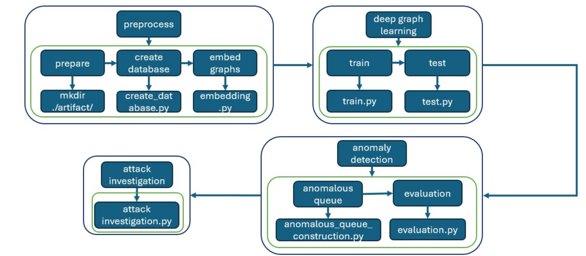
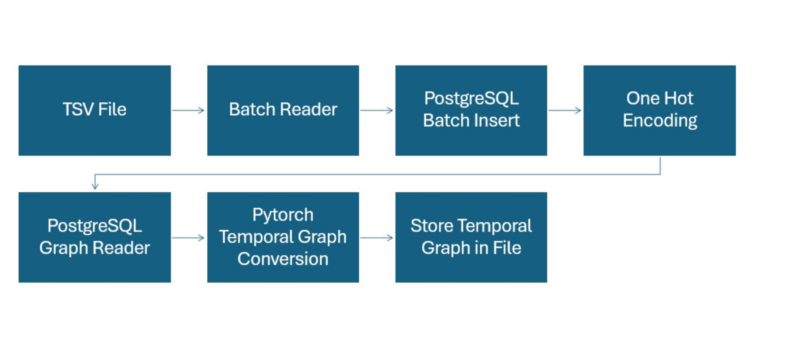

# KAIROS: Practical Intrusion Detection and Investigation using Whole-system Provenance

This repository contains the implementation of the approach proposed in the paper "KAIROS: Practical Intrusion Detection and Investigation using Whole-system Provenance".

## Overview

KAIROS is a system designed to enhance intrusion detection and facilitate comprehensive investigations by leveraging whole-system provenance data. By analyzing the causal relationships between system events, KAIROS aims to provide a practical solution for identifying and understanding security breaches.

## Features

- **Intrusion Detection**: Utilizes provenance data to detect anomalous activities indicative of security threats.
- **Investigation Tools**: Offers tools to trace and analyze the sequence of events leading to and following an intrusion.
- **Comprehensive Analysis**: Provides a holistic view of system operations to aid in understanding complex attack vectors.

## Getting Started


### Prerequisites

- Anaconda
- Python 3.9
- PostgreSQL
- GraphViz
- CUDA

### Installation

1. **Clone the Repository**:
   ```bash
   git clone https://github.com/nahidul-opu/COMP7860-Kairos.git
   cd COMP7860-Kairos
   ```

2. **Virtual Environment Set Up**:

   Follow the Python runtime environment setup instructions written in [Anaconda Python Environment](DARPA/settings/environment-settings.md)
3. **Database Set Up**:

   The preprocessing steps involve storing the parsed logs into a database for each dataset. To work with a specific dataset, you need to create a schema specific for that dataset. Instructions for creating the database is located in [PostgreSQL Database](DARPA/settings/database.md)


## Module Overview
Kairos builds a separate model for each dataset, with each dataset requiring specific preprocessing, training, and testing phases. This project contains of the following top level modules:


[//]: # (- **Unix Environment**)
- **[DARPA TC CADETS Engagement 3](DARPA/CADETS_E3)**
  - **Code Execution Steps**
    - [Download](https://drive.google.com/drive/u/0/folders/179uDuz62Aw61Ehft6MoJCpPeBEz16VFy) dataset and extract files.
    - Update dataset directory in [config.py](DARPA/CADETS_E3/config.py).
    - Create DB schema and run DML as instructed for DARPA CADETS E3 in [database.md](DARPA/settings/database.md)
    - Update PostgreSQL Path/URL and port in [config.py](DARPA/CADETS_E3/config.py)  if it is different from default.
    - Execute [Makefile](DARPA/CADETS_E3/Makefile)
  
    <h2 align="center">Execution Sequence</h>

    
- [DARPA TC CADETS  Engagement 5](DARPA/CADETS_E5)
  - **Code Execution Steps**
     - [Download](https://drive.google.com/drive/u/0/folders/1YOaC0SMGjBnrT9952EwmKKngQkBYf4hY) dataset files.
     - Decompress CMD files with [ta3-java-consumer](https://github.com/darpa-i2o/Transparent-Computing/blob/master/README-E3.md)
     - Update dataset directory in [cadets5_datapreprocess.ipynb](DARPA/CADETS_E5/cadets5_datapreprocess.ipynb)
     - Create DB schema and run DML as instructed for CADETS E5 in [cadets5_datapreprocess.ipynb](DARPA/CADETS_E5/cadets5_datapreprocess.ipynb)
     - Update PostgreSQL Path/URL and port in [cadets5_datapreprocess.ipynb](DARPA/CADETS_E5/cadets5_datapreprocess.ipynb)  if it is different from default.
     - Run preprocessing file [cadets5_datapreprocess.ipynb](DARPA/CADETS_E5/cadets5_datapreprocess.ipynb)
     - Run training and evaluation file [cadets5_graph_learning.ipynb](DARPA/CADETS_E5/cadets5_graph_learning.ipynb)
- [DARPA TC CLEARSCOPE  Engagement 3](DARPA/CLEARSCOPE_E3)
    - **Code Execution Steps**
      - [Download](https://drive.google.com/drive/u/0/folders/1cbOHa5_dlu0XF8od5YKKqCGOawHzqaT_) dataset files.
      - Update dataset directory in [clearscope3_datapreprocess.ipynb](DARPA/CLEARSCOPE_E3/clearscope3_datapreprocess.ipynb)
      - Create DB schema and run DML as instructed for CLEARSCOPE E3 in [database.md](DARPA/settings/database.md)
      - Update PostgreSQL Path/URL and port in  [clearscope3_datapreprocess.ipynb](DARPA/CLEARSCOPE_E3/clearscope3_datapreprocess.ipynb) if it is different from default.
      - Run preprocessing file [clearscope3_datapreprocess.ipynb](DARPA/CLEARSCOPE_E3/clearscope3_datapreprocess.ipynb)
      - Run training and evaluation file [clearscope3_graph_learning.ipynb](DARPA/CLEARSCOPE_E3/clearscope3_graph_learning.ipynb)
- [DARPA TC CLEARSCOPE  Engagement 5](DARPA/CLEARSCOPE_E5)
  - **Code Execution Steps**
    - [Download](https://drive.google.com/drive/u/0/folders/1S-LrRdu1tCjUMQA_VdKj_OXWs4BA7Hk_) dataset files.
    - Decompress CMD files with [ta3-java-consumer](https://github.com/darpa-i2o/Transparent-Computing/blob/master/README-E3.md)
    - Update dataset directory in [clearscope5_datapreprocess.ipynb](DARPA/CLEARSCOPE_E5/clearscope5_datapreprocess.ipynb)
    - Create DB schema and run DML as instructed for CLEARSCOPE E5 in [database.md](DARPA/settings/database.md)
    - Update PostgreSQL Path/URL and port in  [clearscope5_datapreprocess.ipynb](DARPA/CLEARSCOPE_E5/clearscope5_datapreprocess.ipynb) if it is different from default.
    - Run preprocessing file [clearscope5_datapreprocess.ipynb](DARPA/CLEARSCOPE_E5/clearscope5_datapreprocess.ipynb)
    - Run training and evaluation file [clearscope5_graph_learning.ipynb](DARPA/CLEARSCOPE_E5/clearscope5_graph_learning.ipynb)
- [DARPA TC OpTC](DARPA/OpTC)
  - **Code Execution Steps**
    - [Download](https://drive.google.com/drive/u/0/folders/1n3kkS3KR31KUegn42yk3-e6JkZvf0Caa) from google drive. Make sure you have at least 4TB storage.
    - Update dataset directory in [optc_datapreprocess.ipynb](DARPA/OpTC/optc_datapreprocess.ipynb)
    - Create DB schema and run DML as instructed for DARPA OpTC in [database.md](DARPA/settings/database.md)
    - Update PostgreSQL Path/URL and port in [optc_datapreprocess.ipynb](DARPA/OpTC/optc_datapreprocess.ipynb)  if it is different from default.
    - Run preprocessing file [optc_datapreprocess.ipynb](DARPA/OpTC/optc_datapreprocess.ipynb)
    - Run training and evaluation file [optc_graph_learning.ipynb](DARPA/OpTC/optc_graph_learning.ipynb)
- [DARPA TC THEIA  Engagement 3](DARPA/THEIA_E3)
  - **Code Execution Steps**
    - [Download](https://drive.google.com/drive/u/0/folders/1AWXy7GFGJWeJPGzvkT935kTfwBYzjhfC) dataset files.
    - Update dataset directory in [theia3_datapreprocess.ipynb](DARPA/THEIA_E3/theia3_datapreprocess.ipynb)
    - Create DB schema and run DML as instructed for THEIA E3 in [database.md](DARPA/settings/database.md)
    - Update PostgreSQL Path/URL and port in [theia3_datapreprocess.ipynb](DARPA/THEIA_E3/theia3_datapreprocess.ipynb)  if it is different from default.
    - Run preprocessing file [theia3_datapreprocess.ipynb](DARPA/THEIA_E3/theia3_datapreprocess.ipynb)
    - Run training and evaluation file [theia3_graph_learning.ipynb](DARPA/THEIA_E3/theia3_graph_learning.ipynb)
- [DARPA TC THEIA  Engagement 5](DARPA/THEIA_E5)
  - **Code Execution Steps**
     - [Download](https://drive.google.com/drive/u/0/folders/13zdJvC62zsJc2nD7KWxtN9xkk05LdQGw) dataset files.
     - Decompress CMD files with [ta3-java-consumer](https://github.com/darpa-i2o/Transparent-Computing/blob/master/README-E3.md)
     - Update dataset directory in [theia5_datapreprocess.ipynb](DARPA/THEIA_E5/theia5_datapreprocess.ipynb)
     - Create DB schema and run DML as instructed for THEIA E5 in [theia5_datapreprocess.ipynb](DARPA/THEIA_E5/theia5_datapreprocess.ipynb)
     - Update PostgreSQL Path/URL and port in [theia5_datapreprocess.ipynb](DARPA/THEIA_E5/theia5_datapreprocess.ipynb)  if it is different from default.
     - Run preprocessing file [theia5_datapreprocess.ipynb](DARPA/THEIA_E5/theia5_datapreprocess.ipynb)
     - Run training and evaluation file [theia5_graph_learning.ipynb](DARPA/THEIA_E5/theia5_graph_learning.ipynb)
- **[Stream Spot](StreamSpot)**
  - **Code Execution Steps**
      - [Download](https://github.com/sbustreamspot/sbustreamspot-data/blob/master/all.tar.gz) dataset and extract file.
      - Update TSV Dataset File Location in [preprocess.py](StreamSpot/src/preprocess.py)
      - Create DB schema and run DML as instructed in [StreamSpotReadMe.md](StreamSpot/src/README.md)
      - Update PostgreSQL Path/URL and port in [preprocess.py](StreamSpot/src/preprocess.py) if it is different from default.
      - Run python scripts as instructed in [StreamSpotReadMe.md](StreamSpot/src/README.md)
      <h2 align="center">Data Preprocessing Sequence</h>
    
  

[//]: # (- **Windows Environment**)

[//]: # (  - [CADETS  Engagement 3]&#40;DARPA/WINDOWS/CADETS_E3&#41;)

[//]: # (  - [CADETS  Engagement 5]&#40;DARPA/WINDOWS/CADETS_E5&#41;)

[//]: # (  - [CLEARSCOPE  Engagement 5]&#40;DARPA/WINDOWS/CLEARSCOPE_E5&#41;)

# Dataset Download
- [Download DARPA TC CADETS Engagement 3](https://drive.google.com/drive/u/0/folders/179uDuz62Aw61Ehft6MoJCpPeBEz16VFy)
- [Download DARPA TC CADETS  Engagement 5](https://drive.google.com/drive/u/0/folders/1YOaC0SMGjBnrT9952EwmKKngQkBYf4hY)
- [Download DARPA TC CLEARSCOPE  Engagement 3](https://drive.google.com/drive/u/0/folders/1cbOHa5_dlu0XF8od5YKKqCGOawHzqaT_)
- [Download DARPA TC CLEARSCOPE  Engagement 5](https://drive.google.com/drive/u/0/folders/1S-LrRdu1tCjUMQA_VdKj_OXWs4BA7Hk_)
- [Download DARPA TC OpTC](https://drive.google.com/drive/u/0/folders/1n3kkS3KR31KUegn42yk3-e6JkZvf0Caa)
- [Download DARPA TC THEIA  Engagement 3](https://drive.google.com/drive/u/0/folders/1AWXy7GFGJWeJPGzvkT935kTfwBYzjhfC)
- [Download DARPA TC THEIA  Engagement 5](https://drive.google.com/drive/u/0/folders/13zdJvC62zsJc2nD7KWxtN9xkk05LdQGw)
- [Download Stream Spot](https://github.com/sbustreamspot/sbustreamspot-data/blob/master/all.tar.gz)

# Models
Pretrained models shared by the original authors can be downloaded from [Google Drive](https://drive.google.com/drive/u/0/folders/1YAKoO3G32xlYrCs4BuATt1h_hBvvEB6C)